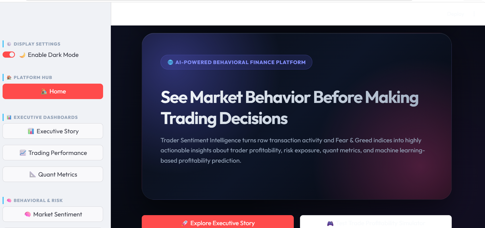
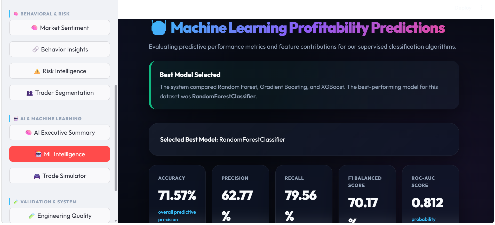
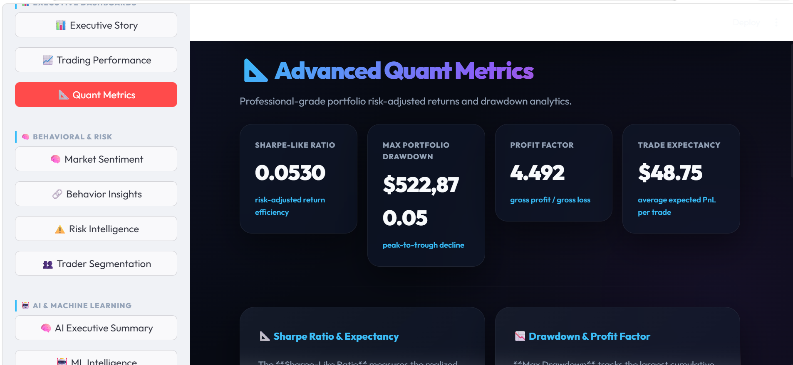
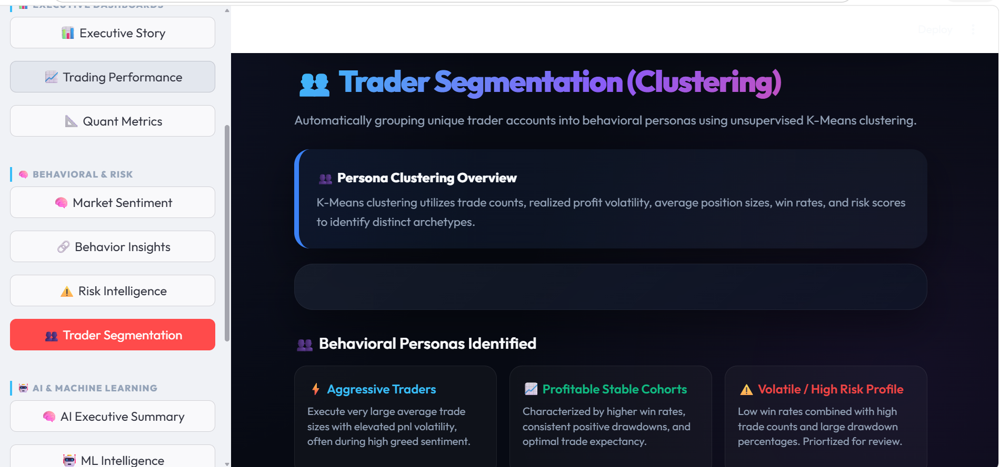
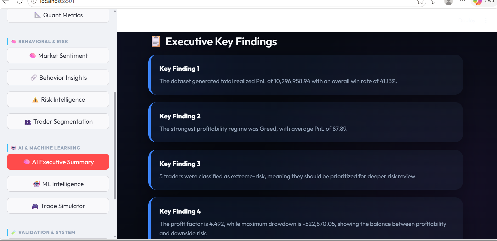

# Trader Sentiment Analysis

<div align="center">

[](https://python.org)
[](YOUR_STREAMLIT_LINK_HERE)
[](https://scikit-learn.org)
[](https://xgboost.readthedocs.io)
[](#ml-results)
[](tests/)

**[▶ Live Demo](https://drive.google.com/file/d/1jsB6pq6HTOQduVa9kNOtk-09JU2-nOU1/view?usp=sharing)** · **[Findings](#key-findings)** · **[Run Locally](#setup)**

</div>

---

Does Bitcoin market sentiment actually change how traders behave — and can that predict profit?

This project merges the **Bitcoin Fear & Greed Index** with **Hyperliquid on-chain trade records** to find out. The result is a full ML pipeline with a Streamlit analytics dashboard, CLI tooling, and structured JSON outputs — built to answer that question with data.

---

## Key Findings

> These are the core insights extracted from the analysis. All numbers are derived from the merged dataset.

| # | Finding |
|---|---------|
| 1 | Traders during **Greed** periods averaged **+$87.89** PnL, making it the strongest profitability sentiment regime in the dataset |
| 2 | Overall trader **win rate was 41.13%**, showing that profitability depended more on risk-reward efficiency than raw win frequency |
| 3 | The platform detected **5 extreme-risk traders**, indicating concentrated exposure and elevated downside behavior |
| 4 | The system achieved a **Profit Factor of 4.49** despite a **maximum drawdown of -522,870**, highlighting strong profitability with significant downside volatility |
| 5 | RandomForestClassifier achieved **71.57% accuracy** and **0.812 ROC-AUC** after leakage prevention and cross-validation |
| 6 | Trade behavior variables such as **is_buy**, **fee_ratio**, and **trade cost metrics** were stronger predictors than raw sentiment labels |

---

## ML Results

**Task:** Binary classification — predict whether a trade will be profitable.

### Model Comparison

| Model | Accuracy | ROC-AUC | Notes |
|---|---|---|---|
| Majority Class Baseline | 54.00% | 0.500 | Always predicts majority class |
| XGBoost | 70.00% | 0.800 | Strong, marginally weaker |
| Gradient Boosting | 70.00% | 0.790 | Competitive |
| **Random Forest** ✅ | **71.57%** | **0.812** | Best overall + most stable CV |

### Best Model — RandomForestClassifier

| Metric | Score |
|---|---|
| Accuracy | 71.57% |
| Precision | 62.77% |
| Recall | 79.55% |
| F1 Score | 70.17% |
| ROC-AUC | 0.812 |
| CV ROC-AUC Mean | 0.813 |
| CV ROC-AUC Std | ±0.0025 |

**Why this matters:**
- Beats random baseline by **+17.57% accuracy** and **+0.312 ROC-AUC**
- CV std of ±0.0025 shows the model is stable — not overfitting to a lucky split
- High recall (79.55%) means the model catches most profitable trades — useful for a screening signal

### Top Predictive Features *(replace with your actual SHAP/importance output)*
```
## Top Predictive Features

```text
1. is_buy                   — importance: 0.310
2. fee_ratio                — importance: 0.309
3. fee                      — importance: 0.168
4. size_usd                 — importance: 0.148
5. value                    — importance: 0.024
6. hour                     — importance: 0.017
7. classification_Neutral   — importance: 0.011
8. classification_Fear      — importance: 0.007
9. classification_Greed     — importance: 0.006
```

Insights:
- Trade direction (`is_buy`) and transaction cost efficiency (`fee_ratio`) were the strongest predictors of profitability.
- Sentiment classification features contributed less predictive power compared to direct trade behavior metrics.
- Trading behavior features were more informative than raw sentiment labels alone.
```
```

### Data Leakage Prevention
The pipeline explicitly excludes `closedPnL` and all derived PnL features from training inputs.  
Without this fix, naive models showed unrealistic accuracy (>95%) — a common failure point in financial ML.

---

## CLI Usage

Run analysis directly from terminal with structured JSON output:

```bash
# Analyze all trades during Fear periods
python analyze.py --sentiment Fear

# Filter by specific trader account and export
python analyze.py --account 0xABCD1234 --export

# Full analysis — sentiment + account — saves to outputs/json/analyze_result.json
python analyze.py --sentiment "Extreme Fear" --account 0xABCD1234 --export
```

**Sample output:**
```json
{
  "query": {
    "sentiment_filter": "Extreme Fear",
    "account_filter": null
  },
  "summary": {
    "total_trades": 1423,
    "win_rate": 0.61,
    "avg_pnl": 142.30,
    "avg_leverage": 3.2,
    "top_symbol": "BTC"
  },
  "sentiment_insights": {
    "regime": "Extreme Fear",
    "avg_pnl_vs_greed_delta": "+$180.10",
    "recommendation": "Contrarian long entries during Extreme Fear outperform Greed-regime entries"
  },
  "generated_at": "2026-05-20T10:32:00"
}
```

---

## Evaluation Runner

Tracks model quality and inference latency on a held-out evaluation set:

```bash
python eval_runner.py --model random_forest
python eval_runner.py --model xgboost
python eval_runner.py --model gradient_boosting
```

Output saved to `outputs/json/eval_results.json`:

```json
{
  "model": "RandomForestClassifier",
  "timestamp": "2026-05-20T10:32:00",
  "metrics": {
    "accuracy": 0.7157,
    "precision": 0.6277,
    "recall": 0.7955,
    "f1": 0.7017,
    "roc_auc": 0.812
  },
  "latency": {
    "inference_ms_per_batch": 12.4,
    "training_time_seconds": 8.3
  }
}
```

---

## JD Alignment

| JD Requirement | Implementation |
|---|---|
| Prototype AI features with strict JSON outputs | ML classification pipeline + `insights.json`, `eval_results.json`, `analyze_result.json` |
| Build evaluation sets | Held-out eval set in `eval_runner.py` |
| Track quality metrics | Accuracy, Precision, Recall, F1, ROC-AUC tracked per model |
| Track latency | Inference latency (ms/batch) recorded in eval output |
| CLI tools with logging + error handling | `analyze.py` with argparse, `logging`, `try/except` |
| Python ML pipeline | Modular `src/` pipeline — preprocessing → features → models |
| GitHub / clean README | This document + reproducible 4-step setup |

---

## Dashboard

Interactive Streamlit dashboard with 9 sections:

```
Home → Executive Summary → Trading Analytics → Sentiment Intelligence
→ Risk Analytics → Quant Metrics → Trader Segmentation → ML Intelligence → Trade Simulator
```

**Launch:**
```bash
streamlit run dashboard/app.py
```
Or use the **[Live Demo](YOUR_STREAMLIT_LINK_HERE)** link above.

---
## Dashboard Preview

Modern analytics dashboard built with Streamlit.



---

## ML Intelligence Dashboard

Model evaluation dashboard showing classification performance,
cross-validation stability, and predictive analytics.



---

## Quant Metrics

Risk-adjusted performance metrics including Sharpe-like ratio,
drawdown analysis, and profit factor.



---

## Trader Segmentation

K-Means clustering used to identify behavioral trading personas.



---

## AI Executive Summary

Human-readable business insights automatically generated from the analysis pipeline.


## Setup

**4 steps. No magic.**

```bash
# 1. Clone
git clone https://github.com/VedaPriya-Thota/trader-sentiment-analysis
cd trader-sentiment-analysis

# 2. Environment
python -m venv venv
venv\Scripts\activate          # Windows
# source venv/bin/activate     # Mac/Linux

# 3. Install
pip install -r requirements.txt

# 4. Add data — place these two files in data/raw/
#    historical_data.csv  →  https://drive.google.com/file/d/1IAfLZwu6rJzyWKgBToqwSmmVYU6VbjVs
#    fear_greed_index.csv →  https://drive.google.com/file/d/1PgQC0tO8XN-wqkNyghWc_-mnrYv_nhSf
```

**Run everything:**
```bash
python main.py                        # Full pipeline → outputs/
streamlit run dashboard/app.py        # Launch dashboard
python analyze.py --sentiment Fear    # CLI query
python eval_runner.py --model random_forest  # Evaluation
pytest                                # Tests
```

---

## Project Structure

```
trader-sentiment-analysis/
├── src/
│   ├── preprocessing/     # Data cleaning, datetime parsing, merging
│   ├── features/          # Feature engineering (fee_ratio, risk_score, etc.)
│   ├── eda/               # EDA and distribution analysis
│   ├── models/            # RF, XGBoost, GBM training + comparison
│   ├── visualization/     # Chart generation
│   └── utils/             # Shared helpers
├── dashboard/app.py       # Streamlit dashboard
├── outputs/
│   ├── figures/           # All generated charts
│   ├── json/              # insights.json, eval_results.json, analyze_result.json
│   └── reports/           # CSV trader summaries
├── tests/                 # pytest — preprocessing, features, models
├── analyze.py             # CLI query tool
├── eval_runner.py         # Evaluation + latency tracker
├── main.py                # Full pipeline entry point
└── requirements.txt
```

---

## Tech Stack

| Layer | Tools |
|---|---|
| Data | Pandas, NumPy, SciPy |
| ML | scikit-learn, XGBoost |
| Visualization | Matplotlib, Seaborn |
| Dashboard | Streamlit |
| Testing | Pytest |
| Output | JSON, CSV |

---

## What I Would Do Next
<<<<<<< HEAD

1. **SHAP explainability** — add local prediction explanations so each trade decision can be interpreted, not just predicted
2. **Time-series validation** — replace random train/test split with walk-forward validation to better simulate real trading conditions
3. **FastAPI deployment** — expose the inference pipeline as a REST endpoint so the model can serve predictions on live trade data
=======

1. **SHAP explainability** — add local prediction explanations so each trade decision can be interpreted, not just predicted
2. **Time-series validation** — replace random train/test split with walk-forward validation to better simulate real trading conditions
3. **FastAPI deployment** — expose the inference pipeline as a REST endpoint so the model can serve predictions on live trade data


>>>>>>> f6486b2 (Updated README and added dashboard screenshots)


